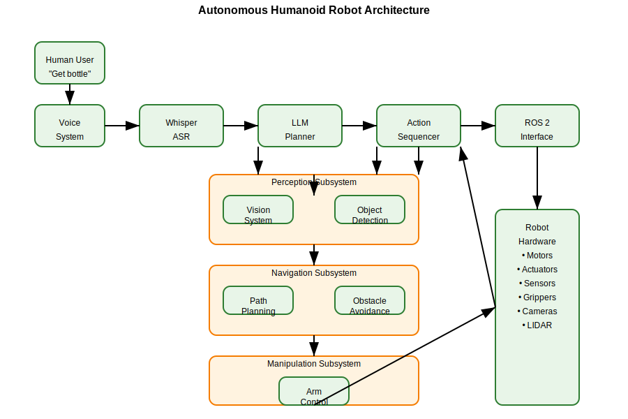

# Capstone — Autonomous Humanoid Robot

This capstone lesson integrates all components of the Vision-Language-Action system to create an autonomous humanoid robot capable of understanding voice commands and executing complex tasks in real-world environments.

## Overview

The full VLA pipeline combines all components learned in this module:

```
Voice Command → Speech Recognition → Language Understanding → Task Planning → Action Execution → Physical Robot
```

## Full Pipeline Architecture

```
                    ┌─────────────────────────────────────────┐
                    │           Voice Command                 │
                    │        "Clean the room"                 │
                    └─────────────────┬───────────────────────┘
                                      │
                    ┌─────────────────▼───────────────────────┐
                    │            Whisper ASR                  │
                    │      Speech-to-Text Conversion          │
                    │   "Clean the room" (text)               │
                    └─────────────────┬───────────────────────┘
                                      │
                    ┌─────────────────▼───────────────────────┐
                    │        LLM Task Planner                 │
                    │   Break down into action sequence       │
                    │  [1. Find trash, 2. Pick up trash,     │
                    │   3. Dispose, 4. Find objects, ...]     │
                    └─────────────────┬───────────────────────┘
                                      │
                    ┌─────────────────▼───────────────────────┐
                    │         ROS 2 Action Layer              │
                    │   Convert to ROS 2 actions/services     │
                    │   [move_to, detect_object, pick_up,     │
                    │    place, navigate, speak]              │
                    └─────────────────┬───────────────────────┘
                                      │
                    ┌─────────────────▼───────────────────────┐
                    │         Physical Execution              │
                    │   Robot performs actions in environment │
                    │   with perception and control systems   │
                    └─────────────────────────────────────────┘
```

## Complete System Implementation

Here's a complete example that integrates all components:

```python
import rclpy
from rclpy.node import Node
from std_msgs.msg import String
from geometry_msgs.msg import Point
from sensor_msgs.msg import Image
from your_robot_interfaces.srv import MoveTo, DetectObject, ManipulateObject
import whisper
import openai
import json
import threading
import time

class AutonomousHumanoid(Node):
    def __init__(self):
        super().__init__('autonomous_humanoid')

        # Publishers and Subscribers
        self.voice_pub = self.create_publisher(String, 'voice_commands', 10)
        self.result_pub = self.create_publisher(String, 'task_results', 10)
        self.image_sub = self.create_subscription(Image, 'camera/image_raw', self.image_callback, 10)

        # Services
        self.move_to_client = self.create_client(MoveTo, 'move_to')
        self.detect_client = self.create_client(DetectObject, 'detect_object')
        self.manipulate_client = self.create_client(ManipulateObject, 'manipulate_object')

        # Initialize Whisper model
        self.whisper_model = whisper.load_model("base")

        # Setup timers
        self.voice_timer = self.create_timer(1.0, self.listen_for_voice)

        # Current state
        self.current_task = None
        self.environment_map = {}
        self.robot_position = Point(x=0.0, y=0.0, z=0.0)

        self.get_logger().info("Autonomous Humanoid Node Initialized")

    def image_callback(self, msg):
        """Process incoming camera images for perception"""
        # Process image for object detection, navigation, etc.
        # Update environment map
        pass

    def listen_for_voice(self):
        """Listen for voice commands"""
        # This would typically use a microphone input
        # For simulation, we'll publish a test command
        test_command = String()
        test_command.data = "Pick up the red cup from the table"
        self.voice_pub.publish(test_command)

    def process_voice_command(self, command_text):
        """Process voice command through LLM planner"""
        # Create environment state
        env_state = {
            "robot_position": {"x": self.robot_position.x, "y": self.robot_position.y},
            "environment_map": self.environment_map,
            "detected_objects": self.get_detected_objects()
        }

        # Plan the task using LLM
        planner = TaskPlanner("your-api-key")
        actions = planner.plan_task(command_text, env_state)

        # Execute the planned actions
        self.execute_action_sequence(actions)

    def execute_action_sequence(self, actions):
        """Execute the sequence of planned actions"""
        for i, action in enumerate(actions):
            self.get_logger().info(f"Executing action {i+1}/{len(actions)}: {action['action']}")

            success = self.execute_single_action(action)

            if not success:
                self.get_logger().error(f"Action failed: {action}")
                # Implement error recovery here
                break

            time.sleep(0.5)  # Small delay between actions

    def execute_single_action(self, action):
        """Execute a single action"""
        action_type = action['action']
        params = action['parameters']

        if action_type == 'move_to':
            return self.move_to_location(params['x'], params['y'])
        elif action_type == 'detect_object':
            return self.detect_object(params['object_type'])
        elif action_type == 'pick_up':
            return self.pick_up_object(params['object_id'])
        elif action_type == 'place':
            return self.place_object(params['location'])
        elif action_type == 'navigate':
            return self.navigate_to_location(params['target'])
        else:
            self.get_logger().warn(f"Unknown action type: {action_type}")
            return False

    def move_to_location(self, x, y):
        """Move robot to specific location"""
        while not self.move_to_client.wait_for_service(timeout_sec=1.0):
            self.get_logger().info('MoveTo service not available, waiting...')

        request = MoveTo.Request()
        request.target.x = float(x)
        request.target.y = float(y)
        request.target.z = 0.0  # Assuming 2D navigation

        future = self.move_to_client.call_async(request)
        rclpy.spin_until_future_complete(self, future)

        if future.result() is not None:
            response = future.result()
            self.robot_position = response.final_position
            return response.success
        else:
            self.get_logger().error('MoveTo service call failed')
            return False

    def detect_object(self, object_type):
        """Detect objects of specific type"""
        while not self.detect_client.wait_for_service(timeout_sec=1.0):
            self.get_logger().info('DetectObject service not available, waiting...')

        request = DetectObject.Request()
        request.object_type = object_type

        future = self.detect_client.call_async(request)
        rclpy.spin_until_future_complete(self, future)

        if future.result() is not None:
            response = future.result()
            return response.success
        else:
            self.get_logger().error('DetectObject service call failed')
            return False

    def pick_up_object(self, object_id):
        """Pick up a specific object"""
        while not self.manipulate_client.wait_for_service(timeout_sec=1.0):
            self.get_logger().info('ManipulateObject service not available, waiting...')

        request = ManipulateObject.Request()
        request.object_id = object_id
        request.action = "pick_up"

        future = self.manipulate_client.call_async(request)
        rclpy.spin_until_future_complete(self, future)

        if future.result() is not None:
            response = future.result()
            return response.success
        else:
            self.get_logger().error('ManipulateObject service call failed')
            return False

    def place_object(self, location):
        """Place object at specific location"""
        while not self.manipulate_client.wait_for_service(timeout_sec=1.0):
            self.get_logger().info('ManipulateObject service not available, waiting...')

        request = ManipulateObject.Request()
        request.object_id = "held_object"  # Assuming robot is holding something
        request.action = "place"
        request.target_location = Point(x=location['x'], y=location['y'], z=location['z'])

        future = self.manipulate_client.call_async(request)
        rclpy.spin_until_future_complete(self, future)

        if future.result() is not None:
            response = future.result()
            return response.success
        else:
            self.get_logger().error('ManipulateObject service call failed')
            return False

    def get_detected_objects(self):
        """Get list of currently detected objects"""
        # This would interface with perception system
        return []

class TaskPlanner:
    """LLM-based task planning class"""
    def __init__(self, api_key: str):
        openai.api_key = api_key

    def plan_task(self, command: str, environment_state: dict):
        """Plan a sequence of actions based on command and environment"""
        prompt = f"""
        You are a robot task planner. Given a command and environment state,
        break down the command into a sequence of specific actions.

        Command: {command}

        Environment state: {json.dumps(environment_state, indent=2)}

        Return a JSON list of actions with the following structure:
        [
          {{
            "action": "action_name",
            "parameters": {{"param1": "value1", "param2": "value2"}},
            "description": "Brief description of what this action does"
          }}
        ]

        Available actions:
        - move_to: Move to a specific location (parameters: x, y)
        - detect_object: Detect objects in the environment (parameters: object_type)
        - pick_up: Pick up an object (parameters: object_id)
        - place: Place an object at a location (parameters: location with x, y, z)
        - navigate: Navigate through the environment (parameters: target)
        """

        response = openai.ChatCompletion.create(
            model="gpt-3.5-turbo",
            messages=[{"role": "user", "content": prompt}],
            temperature=0.1
        )

        try:
            content = response.choices[0].message.content
            json_start = content.find('[')
            json_end = content.rfind(']') + 1

            if json_start != -1 and json_end != -1:
                json_str = content[json_start:json_end]
                actions = json.loads(json_str)
                return actions
            else:
                return [{"action": "move_to", "parameters": {"x": 1.0, "y": 1.0}, "description": "Move to default location"}]
        except json.JSONDecodeError:
            return [{"action": "speak", "parameters": {"text": "Could not understand the command"}, "description": "Speak error message"}]

def main(args=None):
    rclpy.init(args=args)

    humanoid = AutonomousHumanoid()

    try:
        rclpy.spin(humanoid)
    except KeyboardInterrupt:
        pass
    finally:
        humanoid.destroy_node()
        rclpy.shutdown()

if __name__ == '__main__':
    main()
```

## Scenario Example: Object Retrieval

Let's walk through a complete scenario where the robot retrieves an object:

### 1. Voice Command Processing
User says: "Please bring me the blue water bottle from the kitchen table"

### 2. Speech Recognition
Whisper converts speech to: "Please bring me the blue water bottle from the kitchen table"

### 3. LLM Planning
The LLM generates an action sequence:
1. `move_to` - Navigate to kitchen area
2. `detect_object` - Look for "blue water bottle"
3. `pick_up` - Grasp the identified object
4. `move_to` - Navigate back to user
5. `place` - Place the object near the user

### 4. ROS 2 Execution
Each action is converted to ROS 2 service calls and executed by the robot's control systems.

### 5. Perception Integration
Throughout the process, the robot uses its vision system to:
- Navigate safely around obstacles
- Identify the correct object to pick up
- Verify successful completion of each task

## High-Level Architecture Diagram



The above diagram shows the complete architecture of the autonomous humanoid robot, illustrating how all components work together from voice input to physical execution.

## Integration Points

1. **Voice Interface**: Connects human commands to the robot's understanding system
2. **Language Processing**: Translates commands into executable plans
3. **Perception System**: Provides environmental awareness
4. **Action Execution**: Carries out planned tasks in the physical world
5. **Feedback Loop**: Reports task completion and handles errors

## Key Success Factors

- **Robust Speech Recognition**: Accurate conversion of voice to text
- **Effective Planning**: Generation of executable action sequences
- **Reliable Execution**: Consistent performance of robot actions
- **Safe Operation**: Avoidance of collisions and dangerous situations
- **Error Recovery**: Handling of unexpected situations and failures

This capstone project demonstrates the integration of vision, language, and action systems to create truly autonomous humanoid robots capable of understanding and executing complex natural language commands in real-world environments.