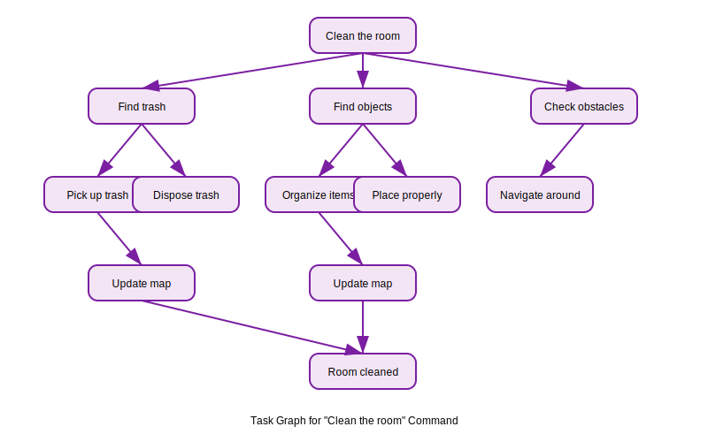

# Cognitive Planning with Large Language Models

This lesson explores how Large Language Models (LLMs) can be used for cognitive planning, translating natural language commands into executable action sequences for robots.

## Overview

Cognitive planning bridges the gap between high-level natural language commands and low-level robot actions. LLMs excel at this task because they can:

- Understand the semantics of natural language commands
- Break down complex tasks into smaller, executable steps
- Reason about the environment and constraints
- Generate action sequences that achieve the desired goal

## Natural Language to ROS 2 Action Sequence

The process of converting natural language to robot actions involves several steps:

```
Natural Language Command → LLM Processing → Task Decomposition → Action Mapping → ROS 2 Execution
```

### Example: "Clean the room" → Task Graph

When given the command "Clean the room", an LLM-based planning system might generate the following task graph:



The above diagram visualizes the task decomposition for the "Clean the room" command.

## Implementation Example

Here's an example of how to use an LLM for task planning:

```python
import openai
import json
from typing import List, Dict, Any

class TaskPlanner:
    def __init__(self, api_key: str):
        openai.api_key = api_key

    def plan_task(self, command: str, environment_state: Dict[str, Any]) -> List[Dict[str, Any]]:
        """
        Plan a sequence of actions based on a natural language command
        """
        prompt = f"""
        You are a robot task planner. Given a command and environment state,
        break down the command into a sequence of specific actions.

        Command: {command}

        Environment state: {json.dumps(environment_state, indent=2)}

        Return a JSON list of actions with the following structure:
        [
          {{
            "action": "action_name",
            "parameters": {{"param1": "value1", "param2": "value2"}},
            "description": "Brief description of what this action does"
          }}
        ]

        Available actions:
        - move_to: Move to a specific location
        - detect_object: Detect objects in the environment
        - pick_up: Pick up an object
        - place: Place an object at a location
        - navigate: Navigate through the environment
        - speak: Speak a message
        """

        response = openai.ChatCompletion.create(
            model="gpt-3.5-turbo",
            messages=[{"role": "user", "content": prompt}],
            temperature=0.1
        )

        try:
            # Extract JSON from the response
            content = response.choices[0].message.content
            # Find JSON part in the response
            json_start = content.find('[')
            json_end = content.rfind(']') + 1

            if json_start != -1 and json_end != -1:
                json_str = content[json_start:json_end]
                actions = json.loads(json_str)
                return actions
            else:
                # If no JSON found, return a simple move action
                return [{"action": "move_to", "parameters": {"location": "random"}, "description": "Move somewhere"}]
        except json.JSONDecodeError:
            return [{"action": "speak", "parameters": {"text": "Could not parse the command"}, "description": "Speak error message"}]

# Example usage
planner = TaskPlanner("your-api-key")

environment = {
    "room_layout": {"kitchen": [1, 1], "living_room": [5, 5], "bedroom": [8, 2]},
    "objects": [
        {"name": "trash", "location": [2, 3], "type": "waste"},
        {"name": "book", "location": [4, 4], "type": "item"}
    ],
    "robot_position": [0, 0]
}

actions = planner.plan_task("Clean the room", environment)
print("Generated action sequence:")
for i, action in enumerate(actions):
    print(f"{i+1}. {action['action']} - {action['description']}")
    print(f"   Parameters: {action['parameters']}")
```

## Integration with ROS 2

The planned actions need to be mapped to ROS 2 actions and services:

```python
import rclpy
from rclpy.node import Node
from geometry_msgs.msg import Point
from std_msgs.msg import String
from your_robot_interfaces.srv import MoveTo, PickUp, Place

class PlanningExecutor(Node):
    def __init__(self):
        super().__init__('planning_executor')
        self.move_to_client = self.create_client(MoveTo, 'move_to')
        self.pick_up_client = self.create_client(PickUp, 'pick_up')
        self.place_client = self.create_client(Place, 'place')
        self.voice_command_sub = self.create_subscription(String, 'voice_commands', self.command_callback, 10)

    def command_callback(self, msg):
        """Process voice command and execute planning"""
        command = msg.data
        # Call the LLM planner
        planner = TaskPlanner("your-api-key")
        environment = self.get_environment_state()
        actions = planner.plan_task(command, environment)

        # Execute the action sequence
        self.execute_action_sequence(actions)

    def execute_action_sequence(self, actions):
        """Execute the sequence of planned actions"""
        for action in actions:
            action_type = action['action']
            params = action['parameters']

            if action_type == 'move_to':
                self.move_to_location(params['location'])
            elif action_type == 'pick_up':
                self.pick_up_object(params['object'])
            elif action_type == 'place':
                self.place_object(params['location'])
            # Add more action types as needed
```

## Planning Flow Diagram

```
User Command (Natural Language)
         ↓
    LLM Processing
         ↓
Task Decomposition
         ↓
Action Sequence Generation
         ↓
ROS 2 Action Mapping
         ↓
Execution Layer
         ↓
Physical Robot
```

## Considerations for Robust Planning

- **Error Handling**: Plans should include error recovery strategies
- **Context Awareness**: Consider current state and environmental constraints
- **Safety**: Ensure all planned actions are safe to execute
- **Efficiency**: Optimize action sequences for minimal time and energy
- **Verification**: Validate plans before execution

In the next lesson, we'll combine all these components in a capstone project for autonomous humanoid behavior.