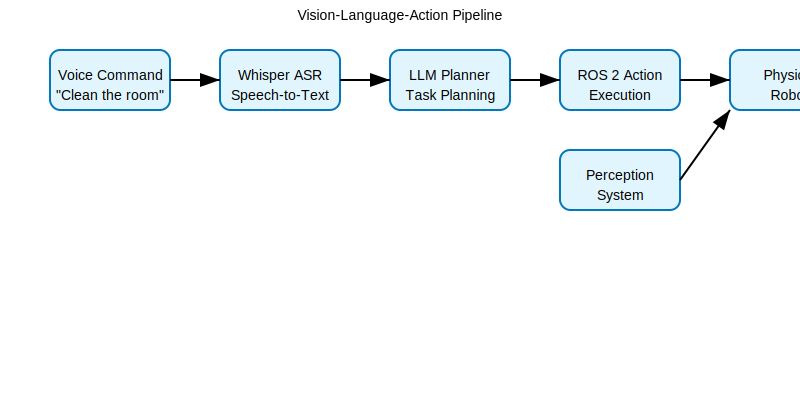

# Voice-to-Action Systems with Whisper

This lesson covers how to implement voice command processing using OpenAI's Whisper model for converting speech to text, which is the first step in the Vision-Language-Action pipeline.

## Overview

Voice-to-Action systems enable robots to understand and respond to natural language commands spoken by humans. The process involves:

1. **Audio Capture**: Recording voice commands from the environment
2. **Speech-to-Text**: Converting audio to textual representation using models like Whisper
3. **Command Interpretation**: Processing the text to understand the intended action
4. **Action Execution**: Performing the requested task in the physical environment

## Whisper Pipeline

Whisper is a state-of-the-art speech recognition model developed by OpenAI. The pipeline for processing voice commands using Whisper includes:

```
Audio Input → Preprocessing → Whisper Model → Text Output → Command Parsing
```

The Whisper model can handle multiple languages and is robust to background noise, accents, and various recording conditions.

## Voice Command Flow Diagram



The above diagram shows the complete Vision-Language-Action pipeline, starting from voice commands and ending with physical robot execution.

## Implementation Example

Here's a basic example of how to use Whisper for voice command processing:

```python
import whisper
import pyaudio
import wave

# Load the Whisper model
model = whisper.load_model("base")

def record_audio(filename, duration=5):
    """Record audio from microphone"""
    chunk = 1024
    format = pyaudio.paInt16
    channels = 1
    rate = 44100

    p = pyaudio.PyAudio()

    stream = p.open(format=format,
                    channels=channels,
                    rate=rate,
                    input=True,
                    frames_per_buffer=chunk)

    print("Recording...")
    frames = []

    for i in range(0, int(rate / chunk * duration)):
        data = stream.read(chunk)
        frames.append(data)

    print("Finished recording.")

    stream.stop_stream()
    stream.close()
    p.terminate()

    wf = wave.open(filename, 'wb')
    wf.setnchannels(channels)
    wf.setsampwidth(p.get_sample_size(format))
    wf.setframerate(rate)
    wf.writeframes(b''.join(frames))
    wf.close()

def transcribe_audio(audio_file):
    """Transcribe audio using Whisper"""
    result = model.transcribe(audio_file)
    return result["text"]

# Example usage
record_audio("command.wav")
command_text = transcribe_audio("command.wav")
print(f"Recognized command: {command_text}")
```

## Example Voice Commands

Common voice commands for robotics applications include:

- "Move forward 2 meters"
- "Turn left and go to the kitchen"
- "Pick up the red cup from the table"
- "Clean the room"
- "Find my keys"
- "Follow me"

## Processing Voice Commands

Once the voice command is converted to text, the system needs to:

1. **Parse the intent**: Understand what action the user wants to perform
2. **Extract parameters**: Identify objects, locations, and other relevant information
3. **Generate action sequence**: Create a series of actions to fulfill the request
4. **Execute the plan**: Perform the actions in the physical environment

## Integration with ROS 2

Whisper output can be integrated with ROS 2 systems by publishing the recognized text to a topic that cognitive planning systems can subscribe to:

```python
import rclpy
from rclpy.node import Node
from std_msgs.msg import String

class VoiceCommandNode(Node):
    def __init__(self):
        super().__init__('voice_command_node')
        self.publisher_ = self.create_publisher(String, 'voice_commands', 10)

    def publish_command(self, command_text):
        msg = String()
        msg.data = command_text
        self.publisher_.publish(msg)
        self.get_logger().info(f'Publishing: {command_text}')
```

## Challenges and Considerations

- **Noise filtering**: Background noise can affect transcription accuracy
- **Real-time processing**: Balancing accuracy with response time
- **Language support**: Supporting multiple languages and accents
- **Context awareness**: Understanding commands in the context of the current environment

In the next lesson, we'll explore how to use Large Language Models for cognitive planning based on the transcribed commands.